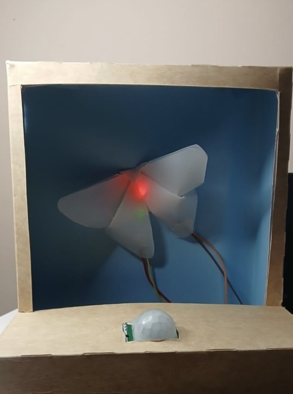

# Taller Interacción Digital 
## Catalina Toledo
Bitácora taller

## 01. ¿Por que identificar bien un problema? 13/08
Antes de diseñar una solución debemos comprender personas, comportamientos y contextos.
El diseño de interacción comienza investigando, la investigación permite pasar de la suposición a la evidencia. 
Partimos con una problemática, observamos, levantando datos para identificar un problema.

* Silver Economy = Servicios para personas mayores +50, envejecimiento activo, autonomía, bienestar y confianza digital.

* ¿Qué nos impide identificar un problema?
  - Información incompleta: Diseñar con una visión parcial 
  - Sesgos: Proyectar experiencias propias sobre otras personas 
  - Complejidad: Los problemas forman parte de sistemas mayores 
  - Tiempo: Comenzar a diseñar demasiado pronto 
  - Experiencia: Desconocer las capacidades, prácticas o contextos del grupo estudiado

## Persona usuaria y contexto
“No basta con definir un segmento demográfico, la persona debe estar contextualizado desde la evidencia” 
La necesidad es distinta a la solución, la necesidad aparece después de comprender la necesidad.

- Síntoma: Lo que observamos la persona abandona el proceso
  
  - USUARIO + CONTEXTO
  - NECESIDAD
  - EVIDENCIA
  - SÍNTOMA
  - HALLAZGO + INSIGHT

  la formulación debe surgir de la investigación y evitar adelantar la solución.

  * NFC: Comparte información por contacto, es una tecnología de comunicación inalámbrica de corto alcance que permite la transmisión instantánea de datos entre dispositivos.

Hacernos cargo de al menos 1 (2 de preferencia) objetivos de desarrollo sostenible de la ONU, para futuros encargos/trabajos.

## Design thinking como proceso proyectual
 

## Doble diamante 
 

## Circuitos eléctricos
Transfiere energía eléctrica en otra forma de luz, calor, movimiento, etc. Es un elemento conductor, el camino “circuito eléctrico” 

Circuito abierto = Flujo de corriente que circula 
Circuito cerrado = No circula corriente por estar interrumpido o no comunicado al circuito

Circuito —-> Voltaje (V) —-> Corriente (I) —-> Resistencia (R)

V = R x I

Corto circuito = Electrones que circulan de forma acelerada, la energía liberada es enorme.

VCC Voltaje = Fuerza electromotriz necesaria para trasladar electrones, es la fuerza que permite que los electrones pasen.

Resistencia eléctrica = Igualdad de oposición que tienen los electrones para desplazarse a través de un conductor. 

Corriente eléctrica = Tasa a la cual fluye la carga, es la cantidad de carga que atraviesa una superficie por unidad de tiempo. Se mide en culombios x segundo, equivale a un amperio (A).

Hay 2 tipos de corriente
Continúa o directa = Fluye siempre en un mismo sentido, como la q proveen baterías comunes
Alterna = Cambia periódicamente de sentido y es producida por un generador de corriente alterna, es la que encontramos en la red doméstica.

Resistividad = Indica que tanto se opone al paso de la corriente eléctrica, a la inversa se denomina conductividad.

# Proyecto
## Concepto: Metamorfosis
## ¿Qué es?
Proyecto basado en la metamorfosis, con un pequeño movimiento ocurre una transformación. (mariposa como protagonista).
## ¿Por qué?
Deforestación, tala ilegal, muerte a ecosistemas. (Perjudica la salud ecológica).
## ¿Cómo?
Sistema con chip NE555, con sensores de movimiento.

 
 
 
